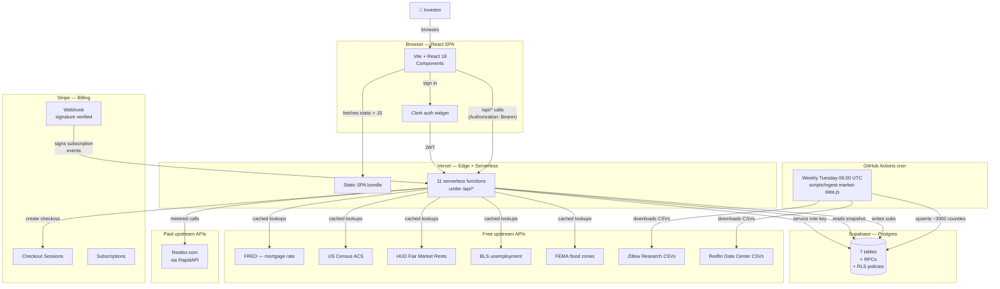
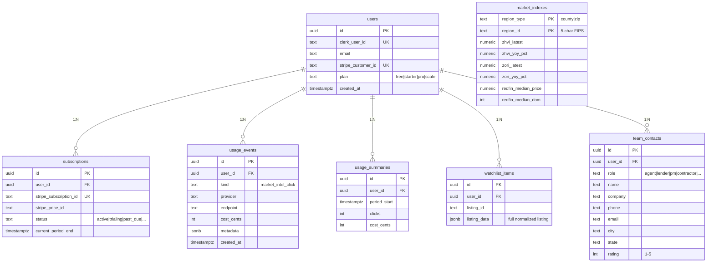
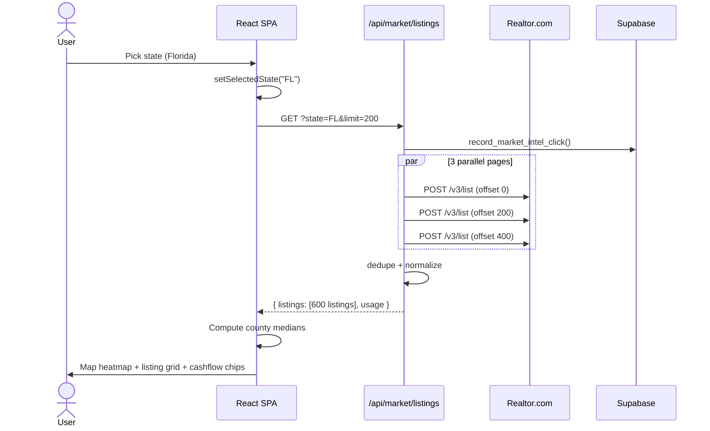
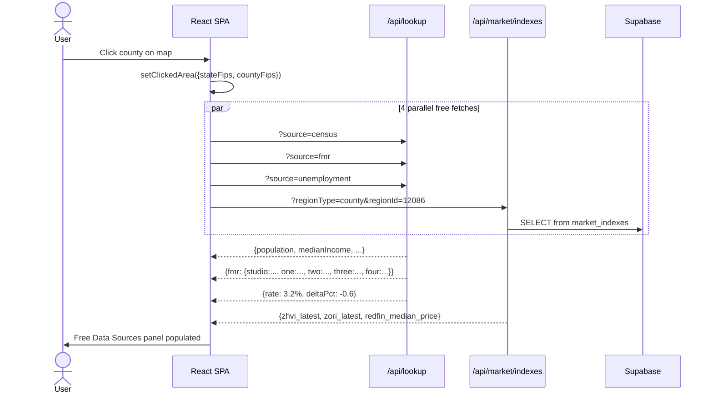
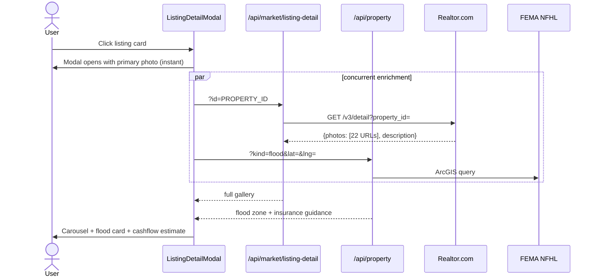
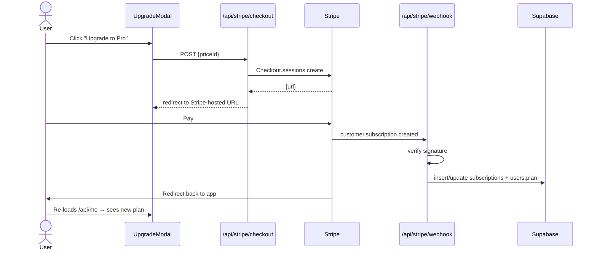
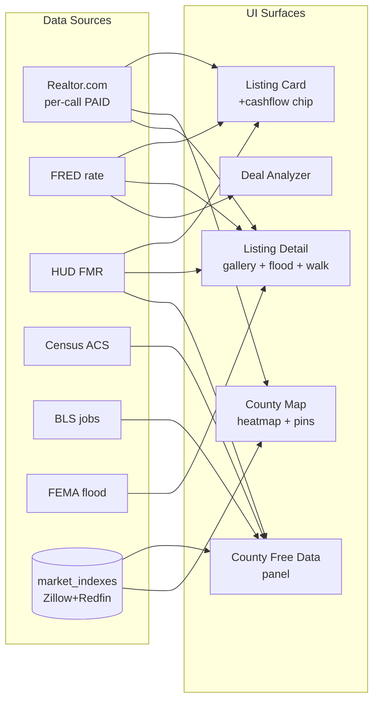

# DealTrack — App Overview

> A SaaS for real estate investors: BRRRR deal analysis + nationwide market intelligence + per-listing cashflow + team CRM.
> Live at **deal-flow-opal.vercel.app**.

---

## 1. The 30-second pitch

DealTrack lets a residential real estate investor:
- **Analyze deals** → enter purchase price, rehab, rents → instant cap rate / cash-on-cash / BRRRR-rule check / printable PDF report
- **Browse the market** → nationwide map colored by live median price, filter by state/county/city, see real listings with photos
- **Screen properties fast** → each listing card shows estimated cashflow at current mortgage rates using HUD Fair Market Rents
- **Save deals + watchlist** → synced per user across devices (Supabase)
- **Build a local team** → roster of agents, lenders, PMs, contractors, etc. per market

Most data sources are **free** government / research APIs. Only one upstream is paid (Realtor.com via RapidAPI) and it's the source of truth for live MLS-grade listings.

---

## 2. System architecture



---

## 3. Tech stack

| Layer | Choice | Why |
|---|---|---|
| Frontend framework | **React 18 + Vite** | Fast dev server, no SSR needed (this is an app, not a content site) |
| Styling | Inline + a small `<style>` tag from `theme.js` | Avoids the build complexity of a CSS-in-JS lib for an app this size |
| Auth | **Clerk** (`@clerk/react`, `@clerk/backend`) | Drop-in social/email sign-in + JWT verification |
| DB | **Supabase Postgres** | RLS-scoped reads, atomic RPC for click counters |
| Billing | **Stripe** Checkout + Customer Portal + webhooks | Standard subscription pattern |
| Hosting | **Vercel** (Hobby plan) | Static SPA + 11 serverless functions; auto-deploys from `main` |
| Maps | `react-simple-maps` + us-atlas TopoJSON | Renders all 3,000+ US counties, zoom/pan, choropleth |
| Charts | `recharts` | Clean React-native chart lib |
| PDF | `jspdf` + `html2canvas` | Client-side investor reports |

---

## 4. Data sources & cost

> The single paid dependency is Realtor.com. Everything else is free.

### Live (per-call) sources

| API | What it feeds | Tier | Per-call cost |
|---|---|---|---|
| **Realtor.com** (RapidAPI realty-in-us) | All sale listings + photos + descriptions | Paid (RapidAPI plan you choose) | 1 user click = 3-4 upstream calls (3 list pages + optional 1 detail when modal opens) |
| **HUD FMR** | Studio→4BR rent baselines per county | Free, key required | Cached 30d in-memory |
| **US Census ACS** | County demographics (population, income, renter share, median rent) | Free, key required | Cached 24h in-memory |
| **FRED** (St. Louis Fed) | Live 30-yr mortgage rate (MORTGAGE30US) | Free, key required | Cached 12h in-memory |
| **BLS** | Local-area unemployment per county | Free, key optional (raises 25→500/day) | Cached 12h in-memory |
| **FEMA NFHL** | Flood zone per address | Free, no key | Cached 24h in-memory |

### Snapshot (weekly cron) sources

| Source | What it gives | Refresh |
|---|---|---|
| **Zillow ZHVI** | Home Value Index per county + YoY % | Monthly upstream → ingested every Tuesday |
| **Zillow ZORI** | Observed Rent Index per county + YoY % | Monthly upstream → ingested every Tuesday |
| **Redfin county tracker** | Median sale price, days-on-market, inventory per county | Monthly upstream → ingested every Tuesday |

The cron lives at [.github/workflows/ingest-market-data.yml](.github/workflows/ingest-market-data.yml) and writes to the `market_indexes` Supabase table.

### Removed / deprecated

- **RentCast** — replaced by HUD + ZORI + Census (free stack)
- **Zillow via RapidAPI** — only kept as a legacy BYOK path for non-SaaS mode

---

## 5. Database schema



Every table has **Row-Level Security** enabled. Reads are scoped to `auth.jwt() ->> 'sub'`. Writes happen only via the service-role key in API functions.

The atomic-click RPC `record_market_intel_click(...)` lives alongside — it inserts into `usage_events` AND increments `usage_summaries` in one transaction so quota cannot be raced.

---

## 6. API endpoints (Vercel serverless functions)

| Endpoint | Purpose | Auth | Metered? |
|---|---|---|---|
| `GET /api/me` | Current user, plan, usage snapshot, public plan catalog | yes | no |
| `GET /api/market/listings?state=&city=&...` | Sale listings (Realtor.com) | yes | **yes** |
| `GET /api/market/listing-detail?id=` | Full photo gallery + description for one property | yes | no |
| `GET /api/market/indexes?regionType=&regionId=` | Zillow ZHVI/ZORI + Redfin snapshot for a county | yes | no |
| `GET /api/lookup?source=` | Multiplexed lookup: census / fmr / unemployment / mortgage | yes | no |
| `GET /api/property?kind=` | Multiplexed: flood (FEMA) / walkscore | yes | no |
| `GET /POST /DELETE /api/watchlist` | Saved-listings CRUD | yes | no |
| `GET /POST /PATCH /DELETE /api/team` | Real-estate team CRUD | yes | no |
| `POST /api/stripe/checkout` | Create Stripe Checkout Session | yes | no |
| `POST /api/stripe/portal` | Customer-portal session | yes | no |
| `POST /api/stripe/webhook` | Stripe webhook receiver (signature verified) | sig | no |

**Vercel Hobby caps total functions at 12** — we're at 11, with headroom.

---

## 7. Key user flows

### A. State-wide market browse



**One user click = three Realtor calls server-side**, dedup'd to ~600 listings spread across ~200 cities (vs. ~30 if we only fetched one page).

### B. County drill-in



### C. Listing detail open



### D. Subscription checkout



---

## 8. Pricing & metering

| Plan | $/mo | Included Market-Intel clicks | Overage |
|---|---|---|---|
| Free | $0 | 0 (paywalled — drives upgrade) | — |
| Starter | $19 | 250 | $0.15 / click |
| Pro | $49 | 1,000 | $0.10 / click |
| Scale | $149 | 5,000 | $0.05 / click |

Source of truth: [api/_lib/plans.js](api/_lib/plans.js).

**A "click" =** one call to `/api/market/listings` (i.e. one state pick or county drill-in). Listing-detail opens, watchlist, team, demographics — none of those count.

The atomic counter lives in `usage_summaries` keyed by `(user_id, period_start)` and the front-end's UsageMeter reads it from `/api/me`.

---

## 9. Formulas

### A. BRRRR / rental-property analyzer
> Source: [src/utils.js:26 `calcMetrics()`](src/utils.js#L26)

```
cashDown            = purchasePrice × (downPayment%/100)
totalInvested       = cashDown + rehabBudget + closingCosts + holdingCosts
projectedNewLoan    = ARV × (refiLtv%/100)
totalAllIn          = purchasePrice + closingCosts + rehabBudget
                      + holdingCosts + refiClosingCosts
allInToArvPct       = totalAllIn / ARV × 100

monthlyP&I          = standard amortization formula
                      L × (r × (1+r)^n) / ((1+r)^n − 1)
                      where r = interestRate%/100/12, n = loanYears × 12

monthlyTaxIns       = (annualPropertyTax + annualInsurance) / 12
monthlyCosts        = monthlyP&I + monthlyTaxIns + capex
                      + repairMaintenance + hoa
vacancyLoss         = rentEstimate × (vacancy%/100)
mgmtCost            = rentEstimate × (mgmtFee%/100)
effectiveIncome     = rentEstimate − vacancyLoss − mgmtCost

monthlyCashFlow     = effectiveIncome − monthlyCosts
annualCashFlow      = monthlyCashFlow × 12
cashOnCash%         = annualCashFlow / totalInvested × 100
capRate%            = annualCashFlow / purchasePrice × 100
totalROI%           = (ARV − totalInvested) / totalInvested × 100
```

#### Quick BRRRR rule checks

| Rule | Pass condition |
|---|---|
| **70% rule** | `purchasePrice + rehabBudget ≤ ARV × 0.70` |
| **1% rule** | `monthlyRent ≥ purchasePrice × 0.01` |

#### Scoring (0–100, derived grade A–D)

| Condition | +Points |
|---|---|
| 70% rule passes | 25 |
| 1% rule passes | 15 |
| Monthly cashflow > 0 | 20 |
| Cash-on-cash > 8% | 15 |
| Cap rate > 6% | 10 |
| Monthly cashflow > $200 | 10 |
| Cash-on-cash > 12% | 5 |

| Score | Grade |
|---|---|
| ≥ 80 | **A** |
| ≥ 70 | **B+** |
| ≥ 60 | **B** |
| ≥ 50 | **C** |
| < 50 | **D** |

### B. Quick cashflow chip (per listing card)
> Source: [src/market/cashflow.js](src/market/cashflow.js)

Conservative defaults for fast property screening:

```
monthlyRent     = HUD FMR for county[bedroomCount]
monthlyP&I      = amortization at 25% down, 30yr, current FRED rate
monthlyTax      = price × 1.2% / 12
monthlyIns      = price × 0.5% / 12
monthlyReserves = monthlyRent × 20%
monthlyCashflow = monthlyRent − P&I − tax − ins − reserves
capRate%        = (monthlyRent − tax − ins − reserves) × 12 / price × 100
```

Renders only when both inputs are present (live mortgage rate AND HUD FMR for the listing's county). Otherwise the chip silently hides.

### C. Map heat scale

The map colors counties on a red-yellow-green scale. The user picks which metric drives it via the dropdown:

| Metric | Direction | Color rule |
|---|---|---|
| Median Price | inverted | lower = greener (more affordable = better) |
| Gross Rent Yield | normal | higher = greener |
| Median Rent | normal | higher = greener |
| Listing Density | normal | more listings = greener (more opportunity) |

For each county, the value is normalized to `t ∈ [0, 1]` against the min/max in the current state's loaded set, then mapped through `scoreToHeatFill(t)`.

---

## 10. Environment variables

> All set in **Vercel → Project → Settings → Environment Variables** (and locally in `.env.local`).

### Client-safe (`VITE_` prefix — bundled into browser JS)

| Var | Purpose |
|---|---|
| `VITE_CLERK_PUBLISHABLE_KEY` | Clerk auth widget |
| `VITE_SUPABASE_URL` | Supabase project URL |
| `VITE_SUPABASE_ANON_KEY` | Supabase anon (RLS-protected) |
| `VITE_STRIPE_PUBLISHABLE_KEY` | Stripe Checkout init |
| `VITE_PRICING_STARTER_PRICE_ID` | Stripe price for Starter plan |
| `VITE_PRICING_PRO_PRICE_ID` | Stripe price for Pro plan |
| `VITE_PRICING_SCALE_PRICE_ID` | Stripe price for Scale plan |

### Server-only (no `VITE_` prefix — never shipped to browser)

| Var | Purpose | Where to get it |
|---|---|---|
| `CLERK_SECRET_KEY` | Verify session JWTs | dashboard.clerk.com → API Keys |
| `SUPABASE_SERVICE_ROLE_KEY` | Admin writes to Supabase | Supabase → Settings → API |
| `STRIPE_SECRET_KEY` | Server-side Stripe calls | dashboard.stripe.com/apikeys |
| `STRIPE_WEBHOOK_SECRET` | Webhook signature verification | Stripe → Webhooks → endpoint |
| `RAPIDAPI_REALTOR_KEY` | **Paid** — Realtor.com listings | rapidapi.com/apidojo/api/realty-in-us |
| `FRED_API_KEY` | Free, mortgage rate | fred.stlouisfed.org/docs/api/api_key.html |
| `CENSUS_API_KEY` | Free, demographics | api.census.gov/data/key_signup.html |
| `HUD_API_TOKEN` | Free, Fair Market Rents | huduser.gov/hudapi/public/register |
| `BLS_API_KEY` *(optional)* | Free, raises BLS rate limit | data.bls.gov/registrationEngine/ |
| `WALKSCORE_API_KEY` *(optional)* | Free 5k/day, walk/bike/transit | walkscore.com/professional/api-sign-up.php |

`FEMA` flood data needs no key; the public ArcGIS endpoint is open.

---

## 11. Repository map

```
.
├── api/                          (Vercel serverless functions — 11 total)
│   ├── _lib/
│   │   ├── auth.js               (Clerk JWT verification)
│   │   ├── db.js                 (Supabase admin client + ensureUser)
│   │   ├── errors.js             (handler + ApiError pattern)
│   │   ├── metering.js           (record_market_intel_click wrapper)
│   │   ├── periods.js            (billing period boundaries)
│   │   ├── plans.js              (plan catalog — source of truth)
│   │   ├── stateFips.js          (FIPS ↔ state code tables)
│   │   └── stripe.js             (Stripe SDK init)
│   ├── market/
│   │   ├── _normalize.js         (Realtor → canonical listing shape)
│   │   ├── listings.js           (state/city listings — METERED)
│   │   ├── listing-detail.js     (full photo gallery + description)
│   │   └── indexes.js            (Zillow + Redfin snapshot lookup)
│   ├── stripe/
│   │   ├── checkout.js
│   │   ├── portal.js
│   │   └── webhook.js
│   ├── lookup.js                 (multiplex: census, fmr, unemployment, mortgage)
│   ├── property.js               (multiplex: flood, walkscore)
│   ├── watchlist.js              (CRUD)
│   ├── team.js                   (CRUD)
│   └── me.js                     (current-user snapshot)
│
├── src/
│   ├── App.jsx                   (router shell, view switcher)
│   ├── theme.js                  (color palette, base styles)
│   ├── utils.js                  (calcMetrics — BRRRR formulas)
│   ├── deals.jsx                 (createBlankDeal, statuses, templates)
│   ├── primitives.jsx            (Panel, NumberField, CalcTooltip)
│   ├── contexts.jsx              (ToastHost, AppActionsContext)
│   ├── ErrorBoundary.jsx         (catches render-time crashes)
│   ├── lib/
│   │   └── saas.js               (all /api/* fetch helpers + Clerk hooks)
│   ├── analyzer/                 (deal analyzer sections + summary + PDF)
│   ├── market/                   (Market Intel — map + listings + cashflow)
│   ├── modals/                   (Calculator, Upgrade, etc.)
│   ├── views/                    (Dashboard, Header, WatchlistView, TeamView, EducationCenter)
│   └── main.jsx                  (root render + ClerkProvider + ToastHost)
│
├── db/
│   └── schema.sql                (Supabase schema — idempotent, run after each release)
│
├── scripts/
│   └── ingest-market-data.js     (Zillow + Redfin CSV → Supabase, weekly via Actions)
│
├── docs/
│   └── APP_OVERVIEW.md           (this document)
│
├── .github/
│   └── workflows/
│       └── ingest-market-data.yml
│
├── vercel.json                   (function config + cron)
├── package.json
└── .env.example                  (template for local + Vercel)
```

---

## 12. Deployment & maintenance

### Routine workflow

1. **Make a change locally** (Vite dev server: `npm run dev`)
2. **`git push origin main`** → Vercel auto-deploys (~30-60s)
3. Vercel's "Deployments" tab shows status; production alias `deal-flow-opal.vercel.app` updates automatically

### Manual one-off tasks

| Task | When | How |
|---|---|---|
| Run `db/schema.sql` | After any schema change | Paste into Supabase SQL Editor |
| Add an env var | When integrating a new API | Vercel → Settings → Environment Variables, then redeploy |
| Re-seed market data | If GH Actions cron fails | `npm run ingest-market-data` locally with `.env.local` populated |
| Update Realtor RapidAPI plan | When click volume grows | rapidapi.com/apidojo/api/realty-in-us → Pricing |

### Monitoring

- **Vercel logs** — `vercel logs <deployment-url>`
- **Supabase logs** — Supabase dashboard → Logs
- **Stripe events** — dashboard.stripe.com/events
- **GitHub Actions** — repo → Actions tab (cron success/failure)

### Known operational watch-points

- **Vercel Hobby plan caps serverless functions at 12.** We're at 11 — adding a new endpoint without consolidation will fail deploy.
- **RapidAPI realty-in-us per-state-search uses 3 of your monthly quota** (we paginate server-side for better city coverage).
- **GitHub Actions cron** only fires on the default branch (`main`) — keep changes merged to main, not just pushed to feature branches.

---

## 13. Interaction map: data → UI



---

## 14. Quick reference — formulas at a glance

| Metric | Formula | Where |
|---|---|---|
| Cap Rate | `annualCashFlow / purchasePrice × 100` | Analyzer |
| Cash-on-Cash | `annualCashFlow / totalInvested × 100` | Analyzer |
| All-in to ARV | `(purchase + closing + rehab + holding + refiCosts) / ARV × 100` | Analyzer |
| 70% Rule | `purchase + rehab ≤ ARV × 0.70` | Analyzer |
| 1% Rule | `monthlyRent ≥ purchasePrice × 0.01` | Analyzer |
| Monthly P&I | `L × (r(1+r)^n) / ((1+r)^n − 1)` standard amortization | Analyzer + cashflow chip |
| Quick cashflow | `HUD_FMR_rent − P&I − 1.2%/yr tax − 0.5%/yr ins − 20% reserves` | Listing card |
| Gross yield | `medianRent × 12 / medianPrice × 100` | Map |

---

*Generated 2026-04-23. Source of truth lives in code — when in doubt, check the linked file paths.*
